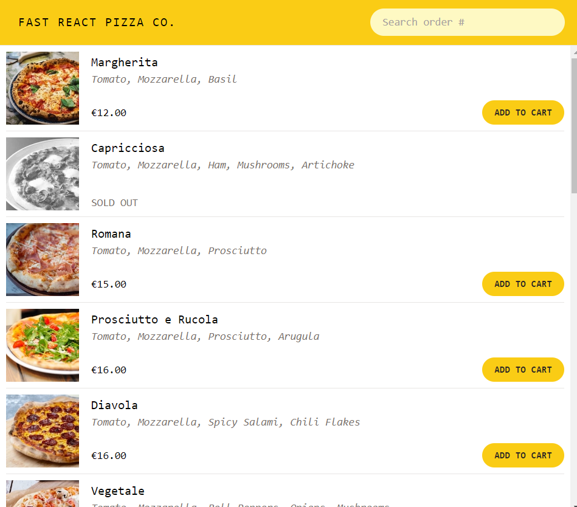

# ReactFood

**Fast Pizza** é um site de estudo onde você pode escolher dentre diversas opções de pizzas com um layout amigável e um formulário para pegar seu endereço automaticamente (caso você permita) e seu número de celular.

## Ferramentas

As tecnologias usadas foram:

- JavaScript - Linguagem de programação
- React.Js - Framework
- Tailwind - Stylesheet

##

- Link para o deploy do site: https://react-fastpizza.netlify.app/

